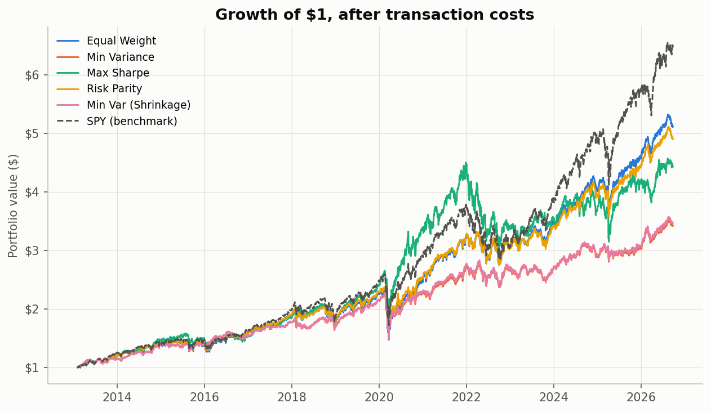
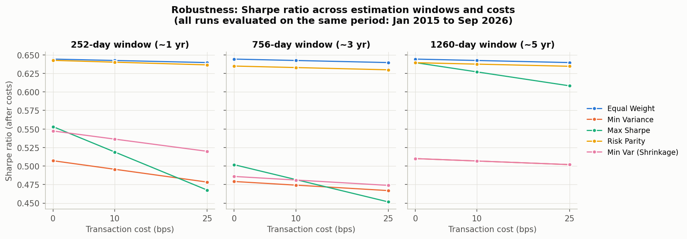
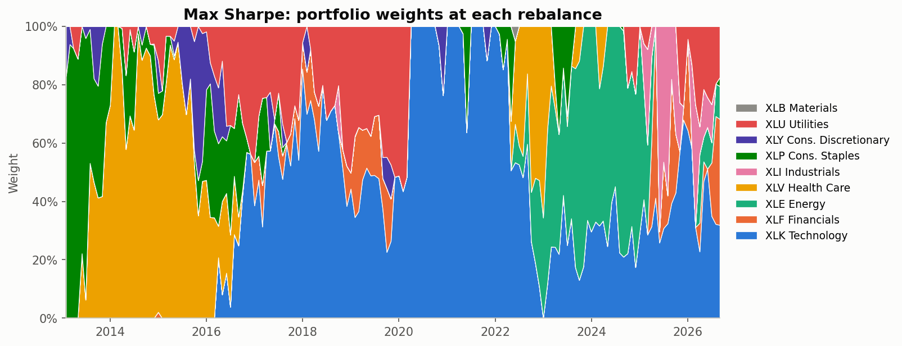
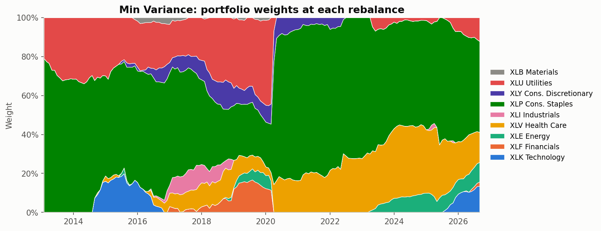
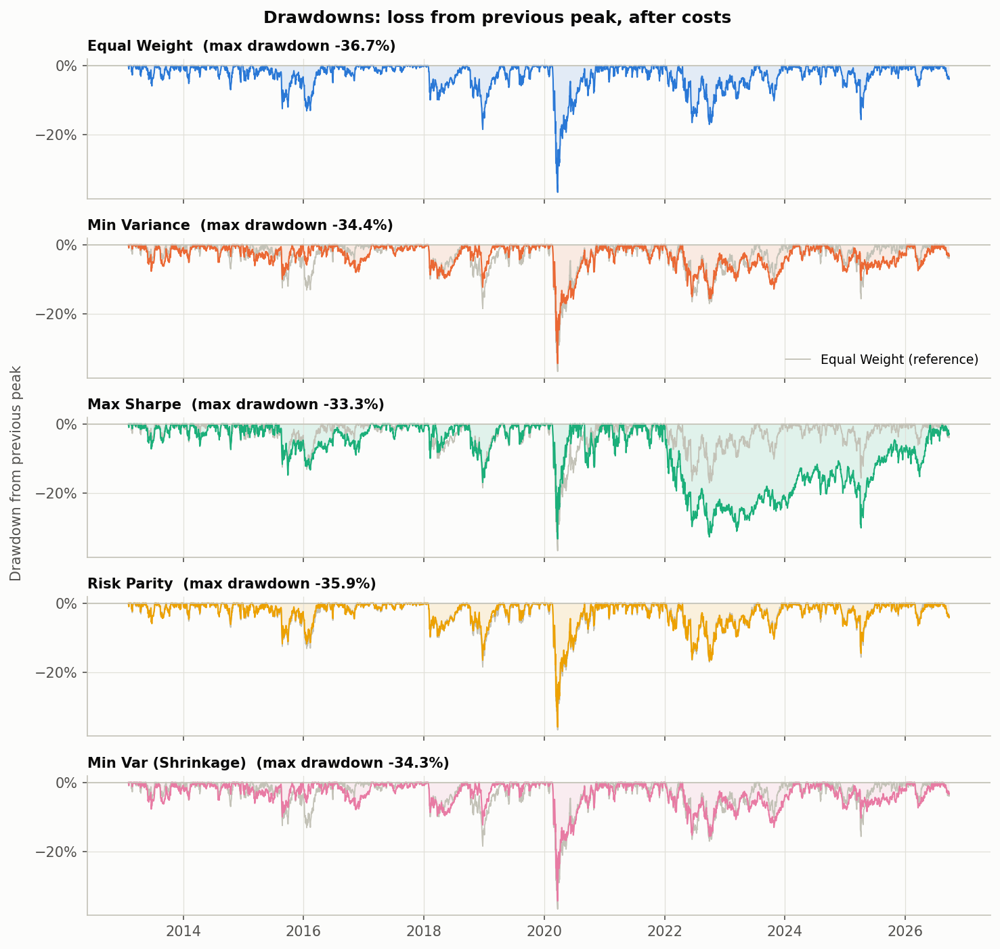

# Portfolio Construction Shootout

> **Does portfolio optimisation actually beat a simple equal-weight portfolio out of sample, once realistic
> constraints and transaction costs are included, and if not, why not?**

This project backtests five long-only portfolio construction methods on the nine SPDR sector ETFs from 2010 to
2026, with monthly rebalancing, no look-ahead bias and transaction costs. It revisits DeMiguel, Garlappi & Uppal
(2009), *"Optimal Versus Naive Diversification: How Inefficient is the 1/N Portfolio Strategy?"*

**Short answer: no, not in any meaningful way.** Over 2013–2026, after costs, no optimiser beat equal weight
(1/N) on a risk-adjusted basis by more than noise. Risk parity finished level with it: 0.003 ahead on Sharpe in
the base case, behind in all nine robustness settings. Every other method did clearly worse. 1/N had the highest
Sharpe ratio in all nine robustness settings (1, 3 and 5 year estimation windows × 0, 10 and 25 bps costs). The reason is **estimation
error**: optimisers treat noisy historical estimates as exact, so they concentrate the portfolio, trade too
much, and pay for it out of sample.



---

## Results (base case: 3-year window, 10 bps costs)

Out-of-sample period **1 Feb 2013 – 25 Sep 2026** (3,433 trading days). All figures are **after transaction
costs**.

| Strategy | CAGR | Volatility | Sharpe | Max Drawdown | Avg Monthly Turnover | Total Costs |
|---|---:|---:|---:|---:|---:|---:|
| Equal Weight (1/N) | **12.74%** | 15.90% | 0.723 | −36.7% | **2.4%** | **0.40%** |
| Min Variance | 9.46% | **13.85%** | 0.595 | −34.4% | 5.5% | 0.90% |
| Max Sharpe | 11.57% | 18.77% | 0.583 | **−33.3%** | 32.5% | 5.30% |
| Risk Parity | 12.39% | 15.28% | **0.726** | −35.9% | 2.6% | 0.42% |
| Min Var (Ledoit-Wolf) | 9.55% | 13.86% | 0.600 | −34.3% | 5.4% | 0.89% |
| *SPY (benchmark only)* | *14.73%* | *16.79%* | *0.798* | *−33.7%* | – | – |

*CAGR is the annual growth rate. Sharpe is excess return over the 3-month T-bill per unit of volatility,
annualised. Turnover is the fraction of the portfolio traded at each monthly rebalance. Full numbers:
[`output/tables/results.csv`](output/tables/results.csv).*

### Robustness: Sharpe ratio across estimation windows and costs

All 45 runs are evaluated on the **same period (Jan 2015 – Sep 2026)**, the first date the 5-year window is
available, so differences come from the window and cost settings rather than from different market periods.

| Window → | 1 yr | | | 3 yr | | | 5 yr | | |
|---|---:|---:|---:|---:|---:|---:|---:|---:|---:|
| **Cost (bps) →** | **0** | **10** | **25** | **0** | **10** | **25** | **0** | **10** | **25** |
| Equal Weight | **0.644** | **0.642** | **0.640** | **0.644** | **0.642** | **0.640** | **0.644** | **0.642** | **0.640** |
| Risk Parity | 0.643 | 0.640 | 0.636 | 0.635 | 0.633 | 0.630 | 0.639 | 0.638 | 0.635 |
| Max Sharpe | 0.553 | 0.519 | 0.468 | 0.502 | 0.482 | 0.452 | 0.640 | 0.627 | 0.608 |
| Min Var (Ledoit-Wolf) | 0.547 | 0.536 | 0.520 | 0.486 | 0.481 | 0.474 | 0.510 | 0.507 | 0.502 |
| Min Variance | 0.507 | 0.496 | 0.478 | 0.479 | 0.474 | 0.467 | 0.510 | 0.507 | 0.502 |

*Equal weight's row is identical across windows because it uses no estimates: the window has no effect on it.*



Full grid (all metrics): [`output/tables/robustness.csv`](output/tables/robustness.csv).

---

## Findings

Each finding below is checked against the hypotheses set before running the backtest. Where the data disagreed,
the finding says so.

**1. Equal weight is hard to beat (hypothesis supported).** 1/N has the highest Sharpe ratio in all nine
robustness settings. The only time anything scored higher was risk parity in the base case, by 0.003 (0.726 vs
0.723), a difference far too small to be meaningful. It estimates nothing, so it has zero estimation error, and it trades very little (2.4% a
month, from undoing price drift), so costs barely affect it.

**2. Max Sharpe is unstable and expensive (mostly supported).** Max Sharpe is the only method that uses expected
returns, and it holds more than 50% in a single sector in 73% of months. On average it holds fewer than three
sectors. It went 100% technology through 2020–21, then spent 2022–25 up to about 30% below its peak while the
other strategies recovered. It trades 13× as much as 1/N and loses 5.3% of cumulative return to costs.

*Where the data disagreed:* with a **5-year window**, Max Sharpe came close to 1/N. At zero cost its Sharpe was
0.640 vs 0.644, and its CAGR was higher (13.7% vs 12.0%). A longer window averages away more of the noise in
mean returns and cuts turnover from 55% to 21% a month. Even so, costs pushed it further behind 1/N (0.608 vs
0.640 at 25 bps), and it was the most volatile strategy (20% a year). A longer window reduced the problem but
did not solve it.



**3. Minimum variance lowers risk but does not improve risk-adjusted returns (hypothesis only partly
supported).** Min variance does what it promises: the lowest volatility (13.9% vs 15.9%) and a smaller drawdown. But it concentrates in
the calmest sectors (Consumer Staples, Utilities, Health Care), holds 50%+ in one sector 79% of the time, and
misses the tech-led rally. Its Sharpe (0.595) is well below 1/N's (0.723) and only marginally above Max
Sharpe's (0.583). In the robustness grid it beats Max Sharpe only at high costs with 1 and 3 year windows. So the
hypothesis that min variance would beat Max Sharpe on risk-adjusted returns held for risk parity but only
partly for min variance.



**4. Risk parity ≈ equal weight (partly supported).** Risk parity finished level with 1/N rather than clearly
beating it: marginally ahead in the base case (0.726 vs 0.723), marginally behind in every robustness setting. The nine
sectors have fairly similar volatilities (13.8%–27.1% a year), so equalising risk contributions produces
weights close to 1/9 each: the largest weight averages just 16%. It trims Energy (the most volatile sector) and
adds to Staples. This lowered volatility slightly (15.3% vs 15.9%) with almost no loss of return.

**5. Shrinkage helps only when data is scarce (partly supported).** With a 1-year window, Ledoit-Wolf lifts min
variance's Sharpe from 0.507 to 0.547 (at zero cost) and trims turnover a little (13.6% → 12.9% a month). With 3 and 5 year
windows it changes almost nothing. The reason: the estimated shrinkage intensity is small (**3.7% for a 1-year
window, 1.8% for 3 years, 1.4% for 5 years**). With only 9 assets, even 252 days gives 28 observations per
asset, so the sample covariance is already fairly reliable. Shrinkage is designed for problems with many assets
and few observations.

**6. SPY beat every strategy.** This is not a failure of the method. SPY is market-cap weighted, and over this
period it was heavily exposed to large US technology stocks, the best-performing part of the market. Every
strategy here spreads money across sectors more evenly than SPY does, so in a tech-led market it lags. SPY is
reported for context only; the research question is about optimisation vs 1/N within the same universe.



---

## Data

| Item | Source / choice |
|---|---|
| Universe | XLK, XLF, XLE, XLV, XLI, XLP, XLY, XLU, XLB (9 SPDR sector ETFs) |
| Excluded | XLRE (launched 2015) and XLC (2018): including them would shorten the history |
| Benchmark | SPY: reported for comparison only, never given to an optimiser |
| Prices | Daily adjusted close from Yahoo Finance (`yfinance`, `auto_adjust=True`), 2010-01-04 onwards. Adjusted prices include dividends, so returns are total returns. |
| Risk-free rate | 3-month T-bill, FRED series `DTB3`, converted to a daily rate: (1 + r)^(1/252) − 1 |
| Returns | Simple daily returns; dates with any missing price are dropped (none were) |

Downloads are cached in `data/raw/` (not committed), so reruns are fast and work offline.

## Method

### Strategies

All strategies are **long-only** (0 ≤ wᵢ ≤ 1) and **fully invested** (Σwᵢ = 1). The optimisers use
`scipy.optimize.minimize` (SLSQP), start from equal weight, and fall back to equal weight with a logged warning
if they fail. None failed in any run. Inputs are annualised (μ × 252, Σ × 252).

| Strategy | Objective | Uses μ? | Uses Σ? |
|---|---|:-:|:-:|
| Equal Weight | wᵢ = 1/N | ✗ | ✗ |
| Min Variance | minimise wᵀΣw | ✗ | ✓ sample |
| Max Sharpe | maximise (wᵀμ − r_f) / √(wᵀΣw) | ✓ | ✓ sample |
| Risk Parity | equal risk contributions RCᵢ = wᵢ(Σw)ᵢ / √(wᵀΣw) | ✗ | ✓ sample |
| Min Var (Ledoit-Wolf) | minimise wᵀΣw | ✗ | ✓ shrunk |

### Backtest rules

1. **Rebalance** on the last trading day of each month.
2. **No look-ahead.** At rebalance date *t*, weights are estimated from the `window` trading days ending at
   *t − 1*. Day *t* itself is excluded.
3. **Timing.** During day *t* the portfolio still holds its old weights. At the close of *t* it trades to the
   new weights, which earn returns from *t + 1*.
4. **Weight drift.** Between rebalances weights move with prices: wᵢ ← wᵢ(1 + rᵢ) / (1 + r_p). Assuming
   constant weights would amount to a free daily rebalance.
5. **Turnover** = Σ|w_new − w_drifted|. **Cost** = turnover × bps / 10,000, deducted on the rebalance day. The
   initial purchase is not charged, because every strategy would pay the same entry cost.
6. All strategies share the same out-of-sample dates.

### How look-ahead bias was avoided (and tested)

- The estimation window is sliced as `returns.iloc[p - window : p]`, where `p` is the rebalance date's row.
  Python slicing excludes `p`, so the rebalance day's return is never used.
- `tests/test_sanity.py::test_no_look_ahead` replaces every return from date *t* onwards with random noise and
  checks that all weights up to and including *t* are identical.
- To confirm the test can catch the bug, I deliberately changed the slice to include day *t*. The test failed
  for all four data-driven strategies, and passed again once the change was reverted.

### Sanity tests

`pytest` runs 20 offline tests on synthetic data:
- weights sum to 1 and are non-negative
- one month of 1/N matches a hand-computed buy-and-hold return
- no NaN returns
- the look-ahead test
- risk parity gives equal risk contributions
- costs equal turnover × bps
- CAGR and drawdown match hand-worked answers
- the robustness trimming logic

---

## Interview Q&A

**Why did mean-variance (Max Sharpe) perform the way it did?**
It needs expected returns, and sample means are extremely noisy: with 20% volatility, even 3 years of data
leaves a standard error of about 11.5% a year on the mean (20% / √3). The optimiser cannot tell skill from
luck. It loads into whatever did best recently (tech in 2020–21, energy in 2023), so it acts as an "error
maximiser" (Michaud, 1989). Recent winners often don't keep winning, so the concentrated bets don't pay off,
and chasing them creates 30%+ monthly turnover. A longer window reduces the noise, which is why Max Sharpe
looked much better with 5 years of data.

**What does risk parity equalise, and why does that help?**
It equalises each asset's *contribution to portfolio volatility*, RCᵢ = wᵢ(Σw)ᵢ / σ_p, rather than each
asset's capital. Under 1/N, volatile sectors such as Energy dominate portfolio risk. Risk parity gives them less
capital so every sector carries the same risk budget. It needs only the covariance matrix (no expected returns),
and it never drops an asset. That makes it far more stable than min variance or Max Sharpe (2.6% monthly
turnover). Here the sectors' volatilities are similar, so it ended up close to 1/N.

**How was look-ahead bias avoided?**
Weights at date *t* use only returns up to *t − 1*, and they are applied from *t + 1*. A unit test confirms
that changing all data from *t* onwards leaves every weight up to *t* unchanged, and I checked that the test
fails if the bias is deliberately introduced. The risk-free rate given to Max Sharpe is also averaged over the
same past window only.

**What does Ledoit-Wolf shrinkage do?**
It replaces the sample covariance S with a blend δF + (1 − δ)S, where F is a simple, stable target (equal
variances, zero correlations) and δ is chosen from the data to minimise expected estimation error. It pulls
extreme, probably noisy covariances towards the average, so the optimiser can't exploit them. Here δ was only
1.4–3.7%, because 9 assets is a small problem relative to the data. That's why it mattered only with a 1-year
window.

**What are the limitations, and what would you do with more time?**
See the next two sections.

---

## Limitations

- **One market, one period.** 2013–2026 was a strong US bull market led by technology. Results could differ in
  a long bear market or for another asset class.
- **Small, correlated universe.** Nine sector ETFs (average pairwise correlation of daily returns 0.64 over the
  full sample) leave little room for diversification gains. DeMiguel et al. show 1/N's advantage grows with the
  number of assets relative to the estimation window.
- **Simple cost model.** A flat 0–25 bps per unit of turnover. There is no bid-ask variation, market impact,
  taxes or financing costs. For liquid SPDR ETFs, 10 bps is conservative.
- **No statistical test.** Sharpe differences of a few hundredths are very likely not statistically
  significant. A Jobson-Korkie/Memmel test or a bootstrap would quantify this.
- **Hindsight in the universe.** The nine sectors were chosen knowing they all survived to today.
- **Execution at the close.** Trading at the same close used for valuation is an idealisation.

## Possible extensions

- Test whether Sharpe differences are significant (Memmel 2003; Ledoit & Wolf 2008 bootstrap).
- A larger universe (e.g. 49 Fama-French industries) to see how the number of assets changes the results.
- A turnover penalty or no-trade band in the optimiser to reduce costs.
- Shrink expected returns (James-Stein or Black-Litterman) instead of dropping them.
- Hierarchical Risk Parity and volatility targeting.

---

## How to run

```bash
python -m venv .venv
source .venv/bin/activate        # Windows: .venv\Scripts\activate
pip install -r requirements.txt
python main.py                   # downloads data, runs everything (~1 min), writes output/
pytest                           # 20 sanity tests
```

All parameters (tickers, dates, window, costs, robustness grid) live in [`config.py`](config.py).

## Project structure

```
├── config.py            # every parameter in one place
├── main.py              # runs the full pipeline
├── src/
│   ├── data.py          # download, cache, clean prices; returns; risk-free rate
│   ├── strategies.py    # the five strategies (one function each)
│   ├── backtest.py      # monthly rebalance loop: no look-ahead, drift, costs
│   ├── metrics.py       # CAGR, volatility, Sharpe, drawdown, turnover, costs
│   ├── robustness.py    # window × cost grid on a common period
│   └── plots.py         # all charts
├── tests/test_sanity.py # 20 offline sanity checks
├── output/
│   ├── figures/         # charts used in this README
│   └── tables/          # results.csv, robustness.csv
└── docs/                # original project and technical specification
```

## References

- DeMiguel, V., Garlappi, L. & Uppal, R. (2009). Optimal Versus Naive Diversification: How Inefficient is the
  1/N Portfolio Strategy? *Review of Financial Studies*, 22(5), 1915–1953.
- Ledoit, O. & Wolf, M. (2004). A Well-Conditioned Estimator for Large-Dimensional Covariance Matrices.
  *Journal of Multivariate Analysis*, 88(2), 365–411.
- Maillard, S., Roncalli, T. & Teïletche, J. (2010). The Properties of Equally Weighted Risk Contribution
  Portfolios. *Journal of Portfolio Management*, 36(4), 60–70.
- Michaud, R. (1989). The Markowitz Optimization Enigma: Is 'Optimized' Optimal? *Financial Analysts Journal*,
  45(1), 31–42.
